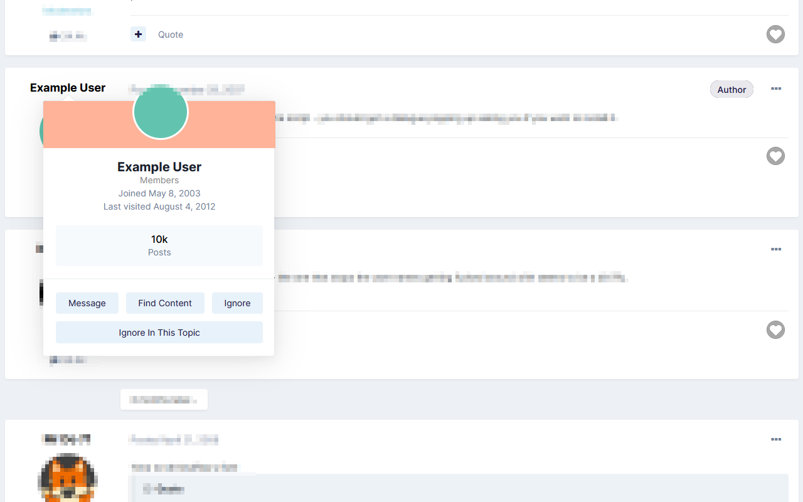
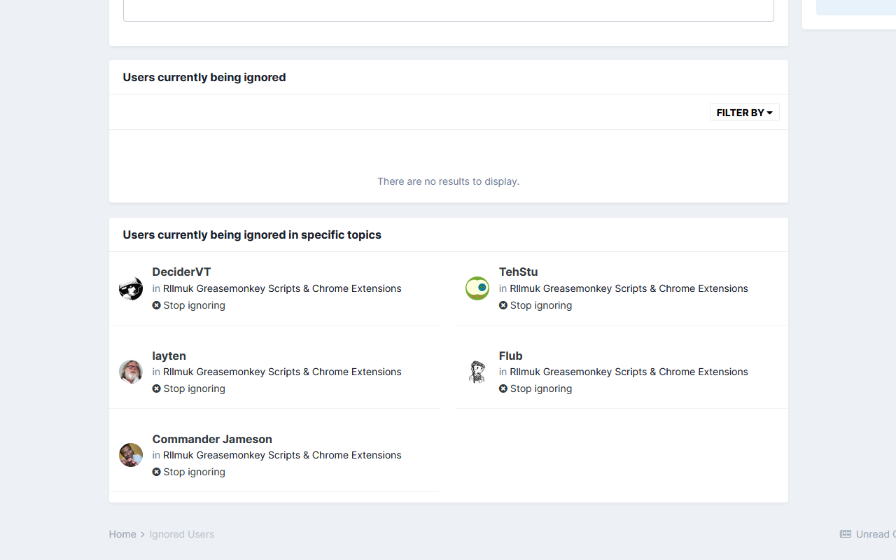

# Rllmuk Really Ignore Users

* [Install Chrome Extension](https://chrome.google.com/webstore/detail/hlikbhdpmjloenbnbiibdljpgnmhdnnk)
* [Install Firefox Add-on](https://addons.mozilla.org/en-US/firefox/addon/rllmuk-really-ignore-users/)
* [Install as a user script](https://greasyfork.org/en/scripts/378211) (requires a [user script manager](https://greasyfork.org/en#home-step-1))

## After installing

### Globally ignored users

Visit the forum's [Ignored Users page](https://www.rllmukforum.com/index.php?/ignore/) and the extension will synchronise itself with your global ignored users settings.

The following will now be hidden in topics:

- "You've chosen to ignore content by…" placeholders for posts by ignored users
- Posts which quote an ignored user
- Posts which @-mention an ignored user

### Ignoring users in specific topics

The extension adds a new "Topic Ignore" control to user profile cards - hover over a user's name and click it to ignore them in the current topic only.

The extension also adds a new section to the [Ignored Users page](https://www.rllmukforum.com/index.php?/ignore/) to manage users ignored in specific topics - click "Stop ignoring" here to stop ignoring a user in that topic.

---

Please remind your fellow forumites to quote or @-mention ignore-worthy users when engaging with them.
